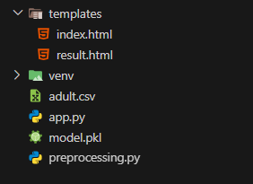
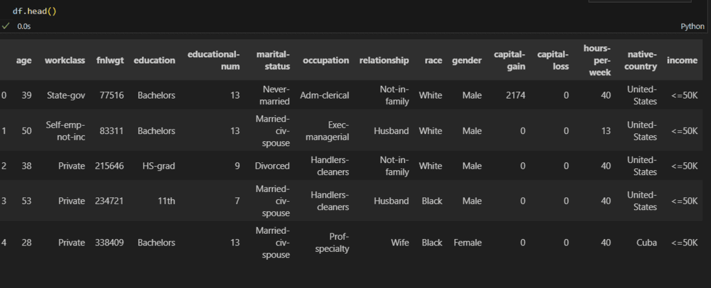
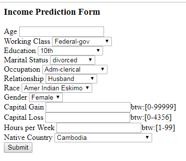
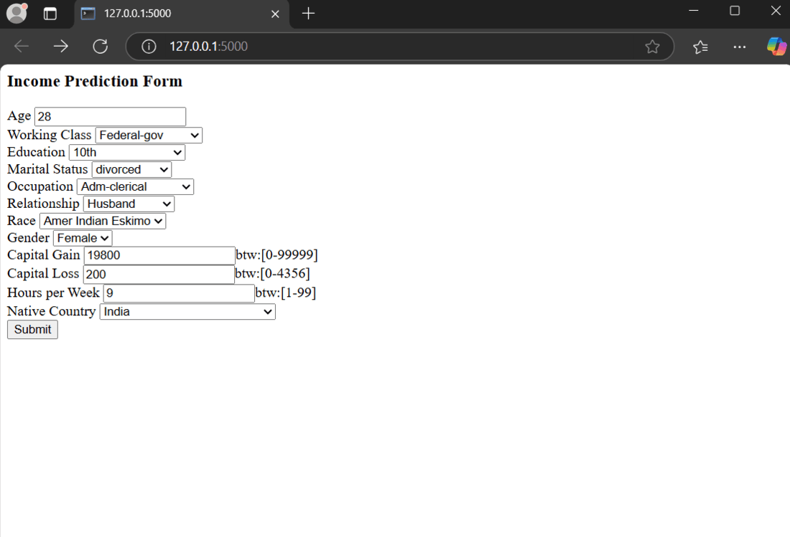

# Deploy Machine Learning Model using Flask

**Last Updated:** 12 Jul, 2025

In this article, we will build and deploy a Machine Learning model using Flask. We will train a Decision Tree Classifier on the Adult Income Dataset, preprocess the data, and evaluate model accuracy. After training, we’ll save the model and create a Flask web application where users can input data and get real-time predictions about income classification. This will demonstrate how to integrate ML models into web applications using Flask.

---

## Installation and Setup

To create a basic flask app, refer to → [Create Flask App](https://www.geeksforgeeks.org/python/flask-creating-first-simple-application/)

After creating and activating a virtual environment install Flask and other libraries required in this project using these commands:

```bash
pip install flask
pip install pandas
pip install numpy
pip install scikit-learn
```

---

## File Structure

After completing the project, our file structure should look similar to this:



---

## Dataset and Model Selection

We are using the **Adult Income Dataset** from the UCI Machine Learning Repository. This dataset contains information about individuals, including age, education, occupation, and marital status, with the goal of predicting whether their income exceeds $50K per year.

👉 [Download Dataset Here](https://media.geeksforgeeks.org/wp-content/uploads/20250324175201901232/adult.csv)

**Dataset Preview:**



We are going to use the **Decision Tree Classifier**, a popular supervised learning algorithm. It is easy to interpret, flexible, and works well with both numerical and categorical data. The model learns patterns from historical data and predicts whether a person’s income is above or below $50K based on their attributes.

---

## Preprocessing Dataset

The dataset consists of 14 attributes and a class label telling whether the income of the individual is less than or more than 50K a year. Before training our machine learning model, we need to clean and preprocess the dataset to ensure better accuracy and efficiency.  
Create a file: **`preprocessing.py`**, it will contain the code to preprocess the dataset.

### Handling Missing Values

```python
# Filling missing values
df.replace("?", np.nan, inplace=True)
df.fillna(df.mode().iloc[0], inplace=True)  # Fill missing values with the mode
```

---

### Simplifying Categorical Data

```python
# Discretization (simplifying marital status)
df.replace(['Divorced', 'Married-AF-spouse', 'Married-civ-spouse',
            'Married-spouse-absent', 'Never-married', 'Separated', 'Widowed'],
           ['divorced', 'married', 'married', 'married',
            'not married', 'not married', 'not married'], inplace=True)
```

---

### Encoding Categorical Variables

Machine learning models work best with numerical data, so we apply **Label Encoding** to convert categorical columns into numerical values.

```python
# Label Encoding
category_col = ['workclass', 'race', 'education', 'marital-status', 'occupation',
                'relationship', 'gender', 'native-country', 'income']
label_encoder = preprocessing.LabelEncoder()

# Creating a mapping dictionary
mapping_dict = {}
for col in category_col:
    df[col] = label_encoder.fit_transform(df[col])
    mapping_dict[col] = dict(enumerate(label_encoder.classes_))  # Improved mapping

print(mapping_dict)

# Dropping redundant columns
df.drop(['fnlwgt', 'educational-num'], axis=1, inplace=True)
```

---

### Splitting Features and Target

```python
# Splitting features and target
X = df.iloc[:, :-1].values  # All columns except last
Y = df.iloc[:, -1].values   # Only last column
```

---

## Training and Saving Model

Now that we have preprocessed our dataset, we can train and save our Machine Learning Model over it.

```python
# Train-Test Split
X_train, X_test, y_train, y_test = train_test_split(X, Y, test_size=0.3, random_state=100)

# Initialize and Train Decision Tree Classifier
dt_clf_gini = DecisionTreeClassifier(criterion="gini", random_state=100, max_depth=5, min_samples_leaf=5)
dt_clf_gini.fit(X_train, y_train)

# Save Model Using Pickle
with open("model.pkl", "wb") as model_file:
    pickle.dump(dt_clf_gini, model_file)
```

---

## Creating `app.py`

```python
#importing libraries
import numpy as np
import flask
import pickle
from flask import Flask, render_template, request

#creating instance of the class
app = Flask(__name__)

#to tell flask what url should trigger the function index()
@app.route('/')
@app.route('/index')
def index():
    return flask.render_template('index.html')

#prediction function
def ValuePredictor(to_predict_list):
    to_predict = np.array(to_predict_list).reshape(1,12)
    loaded_model = pickle.load(open(r"path_to_the_saved_model","rb"))
    result = loaded_model.predict(to_predict)
    return result[0]

@app.route('/result', methods = ['POST'])
def result():
    if request.method == 'POST':
        to_predict_list = request.form.to_dict()
        to_predict_list = list(to_predict_list.values())
        to_predict_list = list(map(int, to_predict_list))
        result = ValuePredictor(to_predict_list)

        if int(result) == 1:
            prediction = 'Income more than 50K'
        else:
            prediction = 'Income less that 50K'

        return render_template("result.html", prediction=prediction)

if __name__ == "__main__":
    app.run(debug=True)
```

**Code Breakdown:**

- Loads and serves a pre-trained ML model (`model.pkl`).
- Accepts user input via a web form and processes it.
- Makes predictions and displays results on `result.html`.
- Runs in debug mode for easy testing.

---

## Creating Template Files

We create all the HTML files in a `templates` folder in Flask.

### `index.html`

```html
<html>
  <body>
    <h3>Income Prediction Form</h3>
    <div>
      <form action="/result" method="POST">
        <!-- Input fields and select elements -->
        <!-- (Full form content preserved as original) -->
      </form>
    </div>
  </body>
</html>
```

**Output:**



---

### `result.html`

```html
<!DOCTYPE html>
<html>
  <body>
    <h1>{{ prediction }}</h1>
  </body>
</html>
```

---

## Complete `preprocessing.py` Code

```python
import os
import pandas as pd
import numpy as np
from sklearn import preprocessing
from sklearn.model_selection import train_test_split
from sklearn.tree import DecisionTreeClassifier
from sklearn.metrics import accuracy_score
import pickle

# Load dataset
file_path = os.path.join("C:", "Users", "Asus", "Desktop", "Suven", "practise_DS", "adult.csv")
df = pd.read_csv(r"path_to_the_dataset")

# Filling missing values
df.replace("?", np.nan, inplace=True)
df.fillna(df.mode().iloc[0], inplace=True)

# Discretization (simplifying marital status)
df.replace(['Divorced', 'Married-AF-spouse', 'Married-civ-spouse',
            'Married-spouse-absent', 'Never-married', 'Separated', 'Widowed'],
           ['divorced', 'married', 'married', 'married',
            'not married', 'not married', 'not married'], inplace=True)

# Label Encoding
category_col = ['workclass', 'race', 'education', 'marital-status', 'occupation',
                'relationship', 'gender', 'native-country', 'income']
label_encoder = preprocessing.LabelEncoder()

# Creating a mapping dictionary
mapping_dict = {}
for col in category_col:
    df[col] = label_encoder.fit_transform(df[col])
    mapping_dict[col] = dict(enumerate(label_encoder.classes_))

print(mapping_dict)

# Dropping redundant columns
df.drop(['fnlwgt', 'educational-num'], axis=1, inplace=True)

# Splitting features and target
X = df.iloc[:, :-1].values
Y = df.iloc[:, -1].values

# Train-Test Split
X_train, X_test, y_train, y_test = train_test_split(X, Y, test_size=0.3, random_state=100)

# Initialize and Train Decision Tree Classifier
dt_clf_gini = DecisionTreeClassifier(criterion="gini", random_state=100, max_depth=5, min_samples_leaf=5)
dt_clf_gini.fit(X_train, y_train)

# Predictions
y_pred_gini = dt_clf_gini.predict(X_test)

# Accuracy Score
print("Decision Tree using Gini Index\nAccuracy:", accuracy_score(y_test, y_pred_gini) * 100)

# Save Model Using Pickle
with open("model.pkl", "wb") as model_file:
    pickle.dump(dt_clf_gini, model_file)
```

---

## Running the Application

To run the application:

```bash
python app.py
```

Then visit the development URL:

```
http://127.0.0.1:5000
```

**Output Snapshot:**


